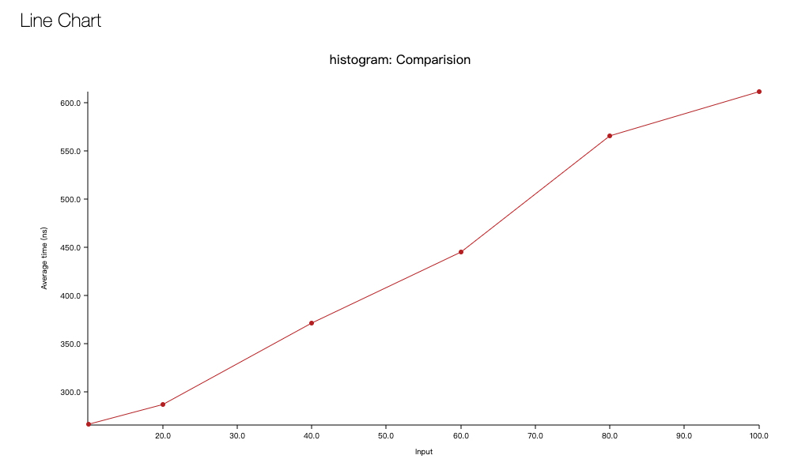

# histogram
a rust library for efficient histogram approximations

This rust library based on the paper: [A Streaming Parallel Decision Tree Algorithm](http://jmlr.org/papers/volume11/ben-haim10a/ben-haim10a.pdf) written by Ben-Haim & Yom-Tov's.

#### Benchmark Result 
Benchmark Environment

```
Laptop   : MacBook Pro (13-inch, 2018, Four Thunderbolt 3 Ports)
Processor: 2.3 GHz 4 Intel Core i5
Memory   : 16 GB 2133 MHz LPDDR3
```
As the benchmark result list below, if you set the bucket size to 50,the average time cost
for each add operation will cost 400-500ns ( >2,000,000 op/s).

